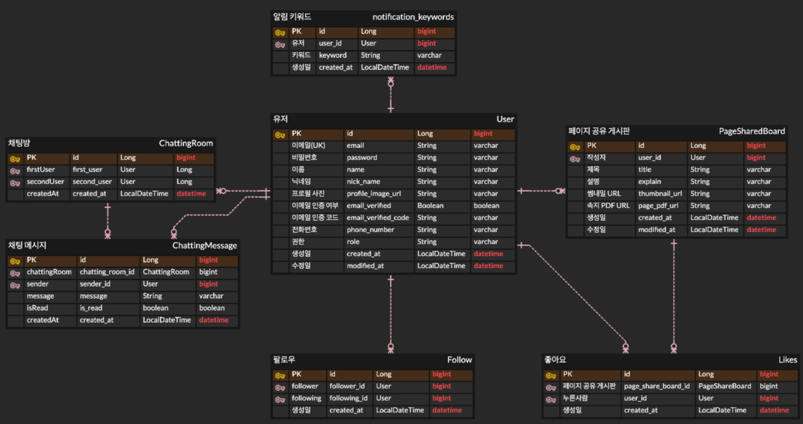

# BestShare
전자노트의 속지를 공유할 수 있는 웹 사이트

## 기술 스택
Backend : Java, Spring Boot, JPA, Docker, Mysql, WebSocket, STOMP \
DevOps : AWS EC2, AWS RDS, AWS S3, Docker

## ERD

## 프로젝트 주요 기능
### 회원가입 / 로그인
    회원가입
    - 중복된 이메일로 회원가입 불가
    - 게시물 작성하기 위해서는 이메일 인증 필요. Mailgun api 사용 예정
    - data input 값은 validation을 사용하여 체크
    
    로그인
    - 이메일과 비밀번호를 통해 로그인
    - 로그인 시 Jwt Token 발행
    - 게시물을 작성하거나 다운은 Token 필요하나 보는 것은 불필요
### 게시물
    작성
    - 게시물 작성 시에 PDF로 노트의 속지 업로드 가능
    - 회원가입 후 로그인 상태에서 게시물 작성 가능

    조회
    - 조회는 로그인 없이 조회 가능하나, PDF파일 접근 시에는 로그인 필요
    - 상세 조회 시 조회수 증가

    수정
    - 게시물 수정 시 내 프로필로 들어갔을 때 가능

### 좋아요
    - 게시물에 대해 좋아요 등록, 등록 취소, 조회

### 팔로우
    - 사람에 대해 팔로우 가능
    - 팔로우 한 사람이 게시물 작성 시 알림에 메시지 제공

### 채팅
    - 게시물 작성자의 프로필을 확인 후 채팅
    - 채팅룸 인원은 2명이며, 2명이 나가게 되면 채팅룸이 삭제됨, 1명만 나갔을 경우 남아 있음
